# Table of Contents

[<b>1 API Data Service Design</b>](#api-data-service-design)

[<b>1.1 Design Goals</b>](#11design-goals)

[<b>1.2 Event of Changes</b>](#event-of-chaanges)

[1.2.1 Business Events](#business-events)

[1.2.2 Data Events](#1.2.2-data-Events)

[1.2.3 Data Quality Service](#data-quality-service)

[<b>1.3 Detail Design</b>](#detail-design)

[1.3.1 Delivery Services](#delivery-services)

[1.3.2 Aggregate Services](#aggregate-services)

[1.3.3 Data Service Design - ESP View](#data-service-design-esp-view)

[1.3.4 Data Service Design - EDP View](#data-service-design-edp-view)

[<b>2. Development Analysis</b>](#development-analysis)

[<b>2.1 ESP Development</b>](#esp-development)

[<b>2.2 EDP Development</b>](#edp-Development)

 
# 1	API Data Service Design 
## 1.1	Design Goals 
The main goal of this design effort is to define architecture patterns to synchronize domain data between TFS’s main systems: Systems of Records (SoR), Enterprise Data Platform (EDP), and Enterprise Service Platform (ESP), as shown in Figure 1.

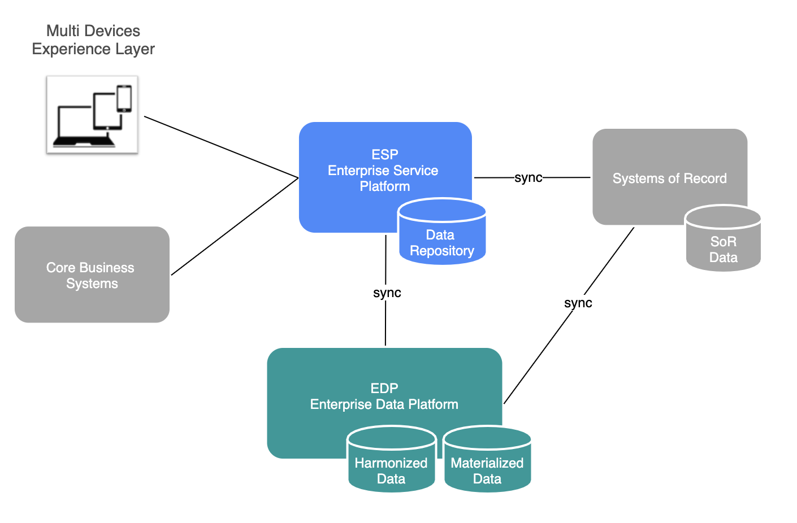
Figure 1: Data Services – Domain 

The focus of this effort is on the design aspects – reference implementation based on the design proposed here will be delivered in the subsequent phases of this project.  
Several Enterprise Architecture (EA) decisions guide our design including:

* Use Domain Driven Design (DDD) and Microservices architectural style for developing solutions that can evolve and adapt to fast changing business needs.
  
* Use Event-Driven architectural style (Patterns) to promote loose coupling between solution components and to facilitate ability to change and adapt to changing business needs. The patterns include:

 - Event Notification Pattern: the source system sends event messages to notify other systems of a changed in its domain.
    - The source system does not expect the response
    - An event need not carry much data
    - The receiver issues a request back to the sender to decide what to do next  
  - Event-Carried State Transfer Pattern: the source system sends event messages to notify other systems of a change in its domain. Messages carry data that has changed – consumers do not need to contact the source system in order to process the change.
  - Event-Sourcing Pattern: this pattern persists the state of a business entity as a sequence of state-changing events.
  - Command Query Responsibility Segregation (CQRS) Pattern uses a different model to update information than the model used to read information. 
* Use Four-Tier architectural style which segregates the following tiers:
 - Services tier
 - Aggregation tier
 - Delivery tier
 - Client
 Four-Tier view of the solution Domain presented in Figure 1 is depicted in Figure 2.

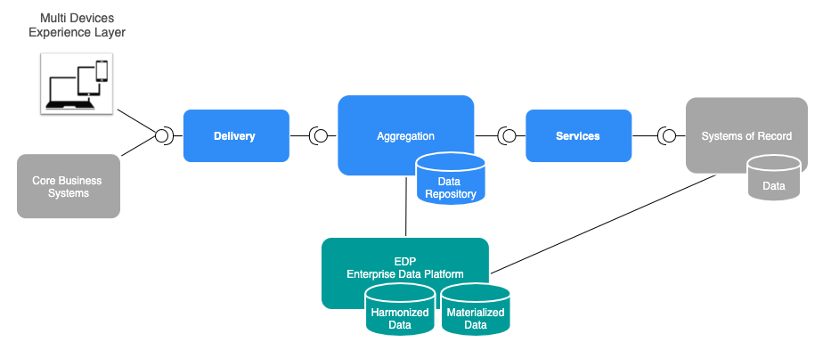
Figure 2: Data Services Domain – Four Tier Architecture View

* ALL data is persisted in the EDP Harmonized Data store. Data quality is enforced through the use of *\<harmonization schema\>* . 
* EDP Harmonized data cannot be consumed through direct access – EDP data is consumed via Data Services exposed as APIs through ESP. 
* EDP Materialized Data is consumer specific.
* ESP services aggregate data from multiple data sources including EDP Materialized Data. 
* ESP services data is cached into “local” Data Repositories for performance reasons as well as to reduce processing load on data sources. 
* Data quality rules are enforced in real time during aggregation of data from all sources. Note that Materialized Data is already harmonized.  
* Realtime aggregation rules are enforced and errors are handled in real time. 
* All configurations are based on JSON/Avro schemas. 

To develop the design, we will analyze the events that can result in domain data inconsistences. Based on that analysis we will design the ESP and EDP components to address the challenges. 

## 1.2	Events of Changes 

There are two major events in the domain that can result in data inconsistent states:
* Business Events:  Customers, Dealers, and CBS make changes to SoR in real-time leaving EDP data in inconsistent state, 
* Data Events: SoRs update periodically EDP data leaving ESP data in inconsistent state.

The following sections discuss these cases in more details and propose design solutions that address the challenges. 

### 1.2.1	Business Events

Starting from a consistent state shown in Figure 1, real-time Business Events that change the SoRs states might leave EDP data in inconsistent state as shown in Figure 2.

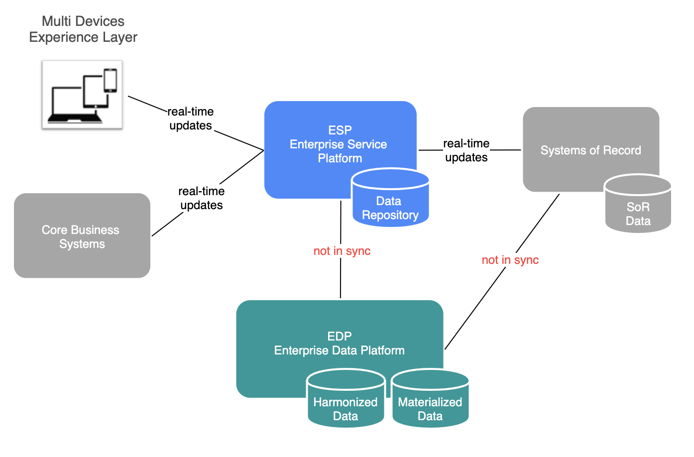
Figure 3: CORs Change SoR in Real-Time

To ensure data integrity, our design calls for implementation of Event-Carried State Transfer Pattern between ESP and EDP platforms as depicted in Figure 4.  

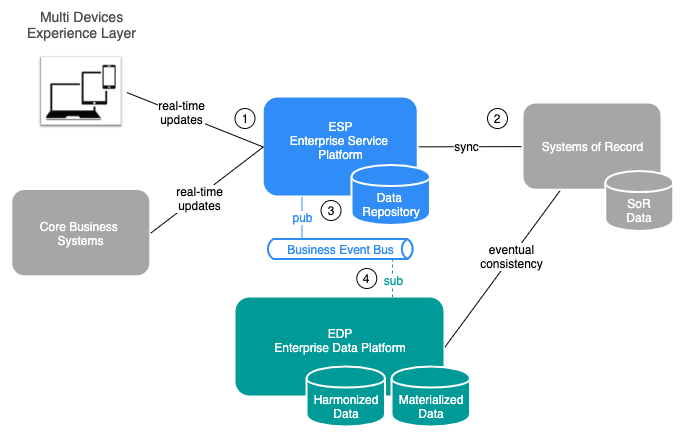
Figure 4: Business Events Synchronization

Following the figure:
 1. Customers, Dealers and CBS make changes to SoR in real-time. 
 2. ESP aggregate services update SoR using Service Tier APIs – at this point rules are enforced, and errors are handled.
 3. On success Data Repository (local cache) is updated and data sources (EDP and others) are notified in real-time by publishing Business Event.
 4. The Business Event is consumed asynchronously by subscribers including EDP.

Typically, amount of data changed during Business Events is not large, so we selected Event-Carried State Transfer Pattern vs Event Notification to synchronize data between ESP and EDP. Obvious benefits that this Pattern offers include:

* Greater resilience, since the recipient systems (EDP and other) can function if the ESP system becomes unavailable.
* Reduce latency, as there's no remote call required to access ESP data.  
* Reduced load on the ESP system. 
* All events and related domain changes are persisted in event and change logs respectively.

### 1.2.2	Data Events

SoRs update periodically EDP data leaving ESP data in inconsistent state as shown in Figure 5.

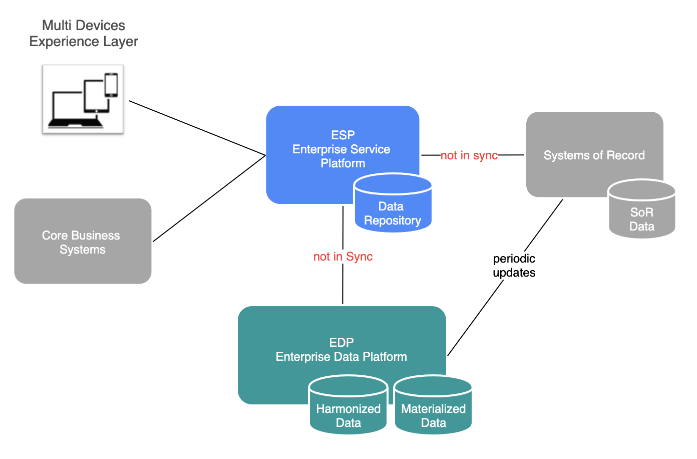
Figure 5: SoRs Change Periodically EDP

To ensure data integrity,  our design calls for implementation of Event Notification Pattern between ESP and EDP platforms as depicted in Figure 6. 

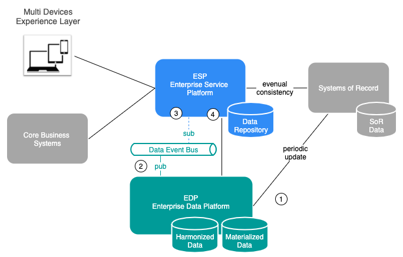
Figure 6: Data Events Synchronization

Note that in this case we opted for Event Notification Pattern since amount of updated data might be significant. Event notification implies a low level of coupling between the systems: 
* The source system publishes an event to notify others of a change in its domain and it does not expect any response,
* The subscriber issues a request back to the publisher to get and process changes, 
* An event does not need to carry much data – it does need to provide call back information.
* All events and related domain changes are persisted in event and change logs respectively.

Following Figure 6:
1. Data in EDP are periodically updated with changes from SoR. Note that all data from SoR needs to be available in EDP.
2. Upon successful Harmonization and Materialization EDP notifies ESP and others about a change in its data in real-time by publishing a Data Event.
3. The Data Event is consumed by ESP and next action is determined based on the call back information.
4. ESP calls-back the publisher to gets the data and updates the Data Repository (local cache) with changes. 

Several options for updating ESP cached data with the changes will be considered in the design including:
* Update only cached data that has changed – ‘Delta’ cache update,
* Update all cached data indiscriminately – ‘Full’ cache update,
* Full update of ESP Data Repositories with the current EDP materialized data – ‘Full’ business layer update.

Figure 7 documents our Event-Driven Data Services Architecture that includes all the architectural and design decisions taken thus far. 

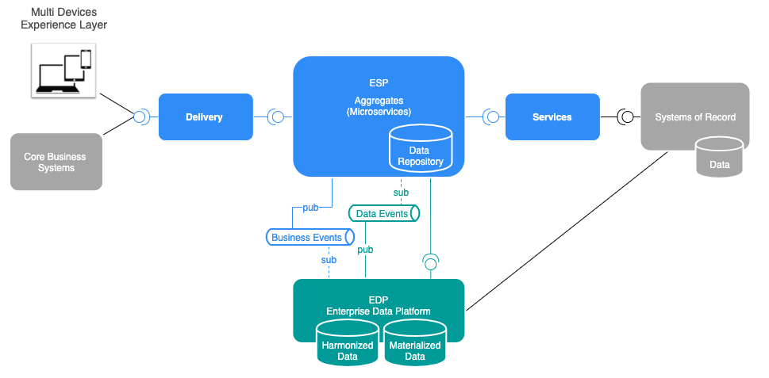
Figure 7: Event-Driven Four-Tier Data Service Architecture

### 1.2.3	Data Quality Service

To ensure data integrity we will develop Data Quality Service which will validate date consistency across SoR, EDP, ESP and document inconsistencies. 

The service will be generic, and it will utilize externalized data schemas of the systems.

We will consider implementing the service utilizing AWS Serverless Framework.

## 1.3	Detail Design
The following sections document detail design of the components shown in Figure 7.

### 1.3.1	Delivery Services

#### 1.3.1.1	Design

Delivery tier is modeled based on Backend for Frontend (BFF) Pattern. Delivery tier implements only data filtering and transforming – domain or business logic should not be implemented in this tier. 

A Delivery Service design is based on simple Request/Response Pattern as shown in Figure 8.

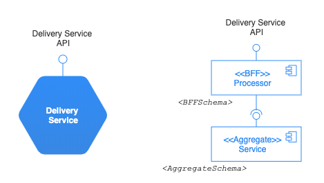

Figure 8: Delivery Service Design

The Processor receives a request, calls appropriate Aggregate Service, uses *\<BFFSchema\>*  and *\<AggregateSchema\>* to performs filtering and returns the result to the requester. 

#### 1.3.1.2	Implementation via Templating

We will develop the Service Template and Registration Service for the Request/Response Pattern as shown in Figure 9.

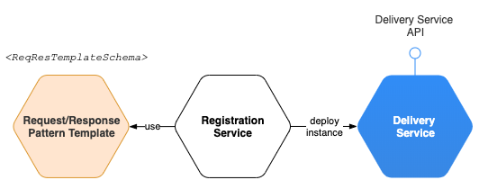
Figure 9: Request/Response Pattern Template

Once developed we can use the Service Template to deploy a Template instance of any Delivery Service. To specialize the Template instance of the Delivery Service to the specific instance’s needs we use *\<BFFSchema\>*, *\<AggregateSchema\>* and modify *BFFHandler*  component as needed. 

### 1.3.2	Aggregate Services

#### 1.3.2.1	Design

An Aggregate Service design is based on the Request/Response Pattern as shown in Figure 10. 

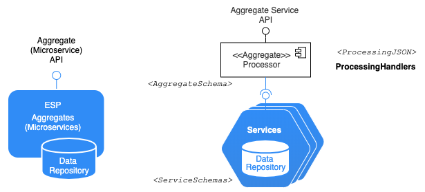
Figure 10: Aggregation Service Design

The Processor uses *\<ProcessingJSON\>* and appropriate *ProcessingHandlers* to implement the instance specific processing logic.

#### 1.3.2.2	Implementation via Templating
A template instance of an Aggregate Service can be instantiated using the Request/Response Pattern Template. To deploy a specific instance of an Aggregate Service we start from the Template and implement the instance specific processing logic in *ProcessingHandlers* utilizing *\<ProcessingJSON\>* and schemas: *\<AggregateSchema\>* and *\<ServiceSchema\>*.

### 1.3.3	Data Service Design – ESP View 

#### 1.3.3.1	Design Option 1 – ‘Delta’ Cache Update 
Data Service design is shown in Figure 11.

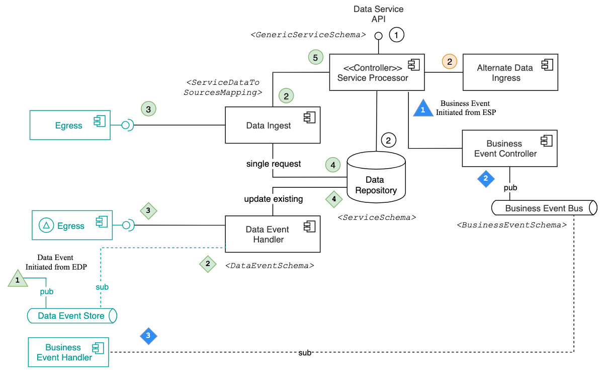
Figure 11: Data Service API Design – Option 1

The notation used in Figure 11 is presented in Figure 12. 

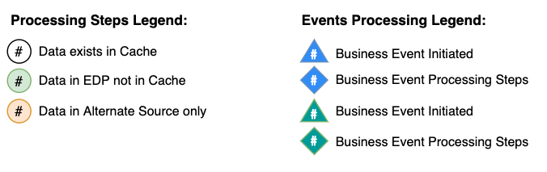
Figure 12: Notation used in Figure 11

Brief architecture walkthrough is as follows: 
* Data exists in Cache scenario (white steps):
 1. Client calls Data Service API  requesting data
 2. Controller retrieves existing data from the Cache and serves the client
* Data exist in EDP & not in Cache scenario (green steps):
 1. Client calls Data Service API requesting data
 2. Controller calls Data Ingress components to access data from EDP
 3. Data Ingress calls EDP Egress service and gets data back
 4. Data Ingress updates Cache
 5. Data Ingress returns result to the Controller for delivery to the client
* Data exist in Alternate Data Sources only scenario (orange steps):
 1. Client calls Data Service API requesting data
 2. Controller calls Alternate Data Ingress component to access data from Alternate Data Source. Alternate Data Ingest returns the data to the Controller for delivery to the client.

Event processing walkthrough is as follows:
 
* Data Event Processing (implements Event Notification Pattern): 
  1. Data Event is published on Data Event Bus by EDP (after, for example, the Materialization of SoR data updates is successfully completed)
  2. ESP Data Event Handler receives Event notification as a subscribed to the event
  3. ESP Data Event Handler uses the call back information from the Event and calls back EDP ‘Delta’ Egress component which returns Cache data that has changed
  4. ESP Data Event Handler updated Cash with the changes.
* Business Event Processing (implements Event-Carried State Transfer Pattern):
  1. Controller updates SoR and Cache with a data change and calls Business Event Controller 
  2. Business Event Controller publishes corresponding Business Event on Business Event Bus
  3. The Business Event is consumed asynchronously by subscribers including EDP Business Event Handler.

Note on Event-Sourcing: All events and associated changes are persisted in Event and Change Logs respectively. 

#### 1.3.3.2	Design Option 2 – Full Cache Update 

Data Service design in this case is shown in Figure 13. 

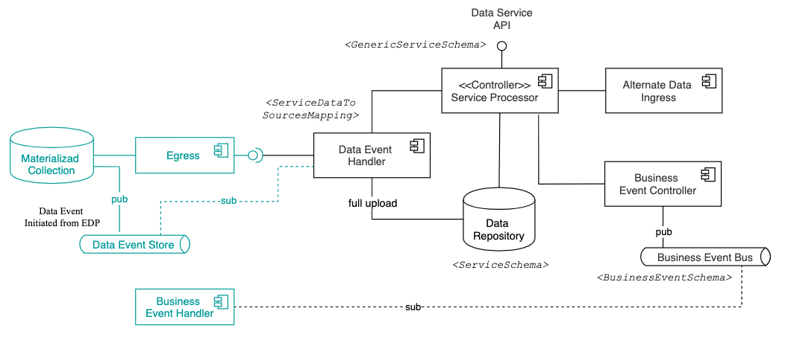
Figure 13: Data Service API Design – Option2

The main difference between Option 1 and 2 is related to processing EDP updates. Design proposed in Option 1 retrieves only ‘Delta’ changes while Option 2 calls for full upload of the Materialized Collection from EDP to ‘Cache’. 
Obviously, Option 2 is might be demanding from both processing time and computational resources demanding and as such it needs to be exercised with caution. 
Note that the same Data Service might support both Options 1 & 2 functionality.

#### 1.3.3.3	Design Option 3 – Materialization into ESP Cache 

Data Service design in this case is shown in Figure 14.

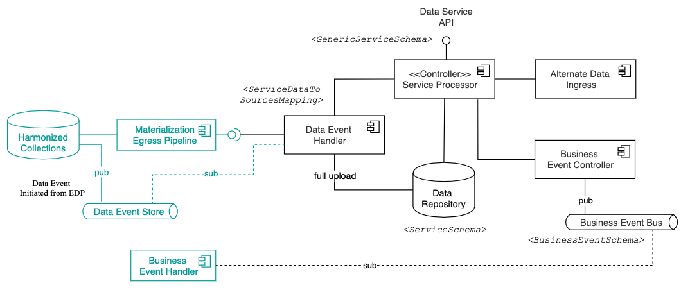
Figure 14: Data Service API Design – Option 3

This design proposes the use of Materialization Egress Pipeline to materialize full collection directly in the ESP Cache. The main benefits of this design include reduced number of transformation hops and considerable saving in storage space (MongoDB storage is not inexpensive). 

#### 1.3.3.4	Implementation via Templating

We will develop the Service Template and Registration Service for the Data Service Pattern as shown in Figure 15.

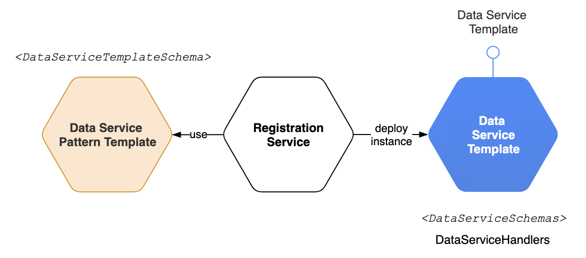
Figure 15: Data Service Pattern Template

Once developed we can use the Service Template to deploy a Template instance of any Data Service. To specialize the Template instance of the Data Service to the specific instance’s needs we use *\<DataServiceSchemas\>* and modify *DataServicesHandlers* as needed. 

### 1.3.4	Data Service Design – EDP View 

EDP design in support of Data Services is shown in Figure 16.

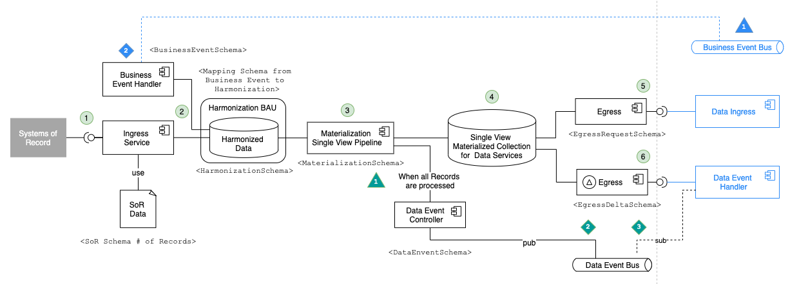
Figure 16: EDP Data Services Design

Brief architecture walkthrough is as follows: 
* Ingesting SoR changes:
 1. Process starts with SoR sending data for egress into EDP
 2. Harmonization follows business as usual process – no changes
 3. Materialization pipeline implements MongoDB Single View approach which preserves both new and old materialized values
 4. Materialization pipeline ingests data into Materialized MongoDB Single View Collection that has both new and old records allowing for ‘Delta’ queries
 5. Egress component supports retrieving full most recent records
 6. ‘Delta’ Egress component uses Single View MongoDB feature and returns only data that has changed during the SoR ingestion

Event processing walkthrough is as follows:
* Data Event Processing (implements Event Notification Pattern): 
 1. Data Event is raised after all SoR data records are processed and Materialization is successfully completed
 2. Data Event Controller publishes Data Event (including call back information) on Data Event Bus
 3. ESP Data Event Handler receives Event notification and uses the call back information from the Event to call back EDP ‘Delta’ Egress component which returns Cache data that has changed.

* Business Event Processing (implements Event-Carried State Transfer Pattern):
 1. Changes to the ESP Cached data result in raising Business Events that are  published on corresponding Business Event Bus
 2.The Business Events are consumed asynchronously by subscribers including EDP Business Event Handler.

# 2	Development Analysis

## 2.1	ESP Development 

|Development Task	|Type|	Complexity|
|----|:------|:-------|
|Develop Req/Resp Pattern Template|	Once per Template	| |
|Develop Registration Service for Req/Res Pattern Template|	Once per Template	| |
|Deploy specific instance of Delivery Service. Start from the Template and implement instance specific processing logic in *BFFHandler* using *\<BFFSchema\>* and *\<AggregateSchema\>*.	|Per Delivery Service Instance	| |
|Deploy specific instance of Aggregate Service. Start from the Template and implement instance specific processing logic in *ProcessingHandlers* utilizing *\<ProcessingJSON\>* and schemas: *\<AggregateSchema\>* and *\<ServiceSchema\>*.	|Per Aggregate Service Instance	||
|Develop Data Service Pattern Template	|Once per Template	| |
|Develop Registration Service for Data Service Pattern Template	|Once per Template	| |
|Deploy specific instance of Data Service. Start from the Template and implement instance specific processing logic in *DataServicesHandlers* utilizing *\<DataServiceSchemas\>* schemas.	|Per Data Service Instance	| |
|Develop Data Quality Service that uses *\<SoRSchema\>*, *\<ServiceSchema\>* and *\<MaterializationSchema\>* to  validate date consistency across SoR, EDP, ESP and document inconsistencies. 	| Potentially Lambda function.	| |

## 2.2	EDP Development

|Development Task	|Type	|Complexity|
|------|:-------|:-------|
|Modify Ingress for SoR file 		| | |
|Modify Harmonization for processing SoR file	| | |		
|Implement Single View Materialization Pipeline	| | |		
|Develop Egress Service			| | |
|Develop ‘Delta’ Egress Service		| | |	
|Enable EDP for Event-Processing including: <li>Event Streams</li> <li>Event Handlers</li> <li>Event Controller</li>			| | |

